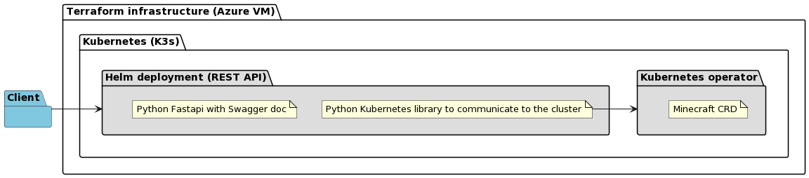
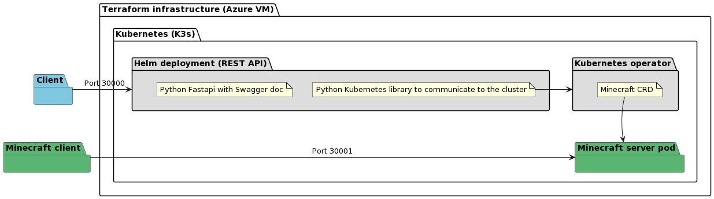
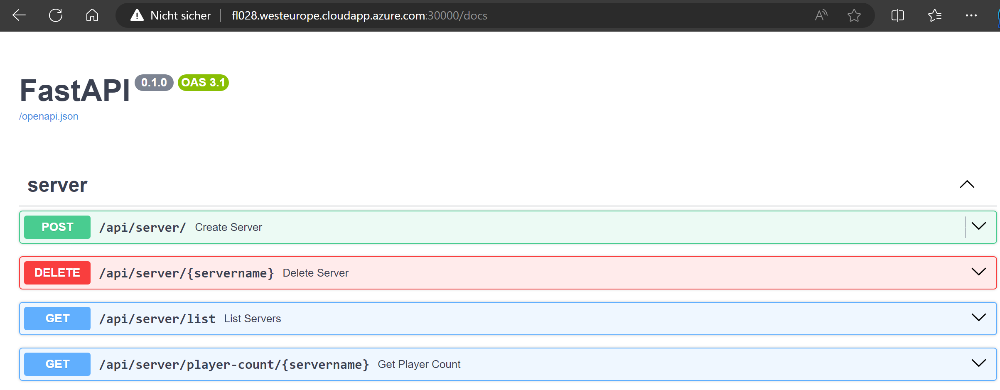

# k8s-minecraft-server-provider

This is the documentation of the "Kubernetes Minecraft server provider" project. This Git repository contains Terraform scripts designed to deploy a Kubernetes cluster on a Azure Virtual Machine. The Virtual Machine is configured using cloud-init, installing [K3s](https://k3s.io/) as kubernetes cluster, complemented by a Kubernetes Operator. This Operator empowers users to create [Minecraft](https://www.minecraft.net/) servers on demand through a REST API. This setup offers users the convenience of requesting their personalized Minecraft server pods effortlessly.

## Table of Contents

- [Prerequisites](#prerequisites)
- [Getting Started](#getting-started)
  - [Overview and Architecture](#overview-and-architecture)
  - [Terraform Deployment](#terraform-deployment)
    - [Folder Structure](#folder-structure)
    - [Cloud Init](#cloud-init)
    - [Example](#example)
  - [Kubernetes Operator](#kubernetes-operator)
  - [REST API](#rest-api)
    - [Container](#container)
    - [Helm Chart](#helm-chart)
- [Usage](#usage)
- [Todos and Ideas](#todos-and-ideas)
- [License](#license)

## Prerequisites

Before embarking on this project, it is crucial to ensure that the following prerequisites are met:

- **Azure Account**: Access to an Azure account is imperative for deploying the VM.

- **Azure Service Principal**: To interact with Azure resources programmatically, you'll need to create an Azure Service Principal. This is used to authenticate and authorize the Terraform deployment.

- **Terraform**: Installation of Terraform on your local machine is essential.

- **Environmental variables**: Access to an Azure account is imperative for deploying the VM.

## Getting Started

This chapter describes how to create the environment. The four individual components are described in more detail. The four components can also be found in the project structure. The four folders: [helm](helm), [operator-sdk](operator-sdk), [python](python) and [terraform](terraform) show which technologies are used.

### Overview and Architecture


*This image shows the components of the project. (Image created with [plantuml](docs/plantuml-overview.txt))*


*In this example a server pod is created via the API (Port 30000). The player can connect via the Minecraft client to the pod (Port 30001). (Image created with [plantuml](docs/plantuml-example.txt))*


### Terraform Deployment

#### Folder Structure

1. [vars.tf](terraform/infrastructure/vars.tf): Contains variable definitions, including Azure configuration and server/domain settings. The environment variables starting with TF_VAR are automatically entered by terraform. The following environment variables are required:

    - TF_VAR_AZURE_SUBSCRIPTION_ID: Your Azure subscription ID.
    - TF_VAR_AZURE_TENANT_ID: Your Azure tenant ID.
    - TF_VAR_AZURE_CLIENT_ID: Your Azure client ID (Service Principal).
    - TF_VAR_AZURE_CLIENT_SECRET: Your Azure client secret (Service Principal).
    - TF_VAR_PROJECT_ROOT_PATH: Path to the project root directory.
    - TF_VAR_SERVER_DOMAIN: Your server's domain name.

2. [ssh.tf](terraform/infrastructure/ssh.tf): This directory manages SSH key generation and related resources. It includes the following components:

    - random_pet and azapi_resource_action resources: These generate SSH key pairs.
    - azapi_resource resource: Manages the Azure SSH public key resource.
    local_file resource: Creates the private key PEM file locally.

3. [providers.tf](terraform/infrastructure/providers.tf):  This file specifies the required providers for Terraform to interact with various resources. It includes configurations for the following providers:

    - azapi: Responsible for authenticating with Azure using the Azure Service Principal credentials.
    - azurerm: Manages Azure resources.
    - random: Generates random values for resource naming.
    - local: Manages local resources.

4. [main.tf](terraform/infrastructure/main.tf): This file defines the core infrastructure setup. It deploys a series of Azure resources to create the desired infrastructure. Key resources include:

    - azurerm_resource_group: Creates an Azure Resource Group.
    - azurerm_virtual_network: Sets up a virtual network.
    - azurerm_subnet: Defines a subnet within the virtual network.
    - azurerm_public_ip: Allocates a dynamic public IP address with a dns name.
    - azurerm_network_security_group: Configures a network security group with specific rules. It acts like a fire wall. The created SSH, API-HTTP and MC-SERVER exceptions allow access from the Internet. The API port 30000 through which the REST API will be accessible should be highlighted. The ports above 30000 are reserved for the created Minecraft pods. 
    - azurerm_network_interface: Creates a network interface for the virtual machine.
    - azurerm_linux_virtual_machine: Deploys a Linux virtual machine (VM) with custom data, SSH access, and other configurations.
    - azurerm_storage_account: Sets up a storage account for boot diagnostics.
    - local_file "vscode_ssh_config": Generates an SSH configuration file for connecting to the VM.
    - data "template_cloudinit_config": Defines cloud-init configurations for VM initialization. The following section goes into detail about the individual commands.

#### Cloud Init
These `runcmd` commands collectively set up the environment, install necessary tools and dependencies, configure Kubernetes, prepare Docker, build and deploy Docker images, and install the required components for the Minecraft server setup.

The `runcmd` directive within `template_cloudinit_config` specifies a list of commands that will be executed on the VM during the initial boot process. These commands are essential for setting up the VM environment and preparing it for further configuration and application deployment. Here is a breakdown of the `runcmd` commands:

1. `date +"%T.%N"`: Outputs the current timestamp with nanosecond precision. This is for logging and debugging purposes.

2. `echo "Start cloud init"`: Prints a message indicating the start of the cloud-init process.

3. `mkdir /tmp/workspace`: Creates a temporary workspace directory.

4. `cd /tmp/workspace`: Changes the working directory to the temporary workspace.

5. `echo "Clone repo"`: Prints a message indicating the cloning of a Git repository.

6. `git clone https://github.com/fl028/k8s-minecraft-server-provider.git`: The own Git repository is cloned to have all files available locally.

7. `echo "Start k3s installation"`: Indicates the start of the installation of K3s, a lightweight Kubernetes distribution.

8. `cd`: Changes the working directory back to the home directory.

9. `ufw disable`: Disables the Uncomplicated Firewall (UFW), which may be running on the VM. This is necessary for the successful kubernetes installation.

10. `curl -sfL https://get.k3s.io | sh -s - --write-kubeconfig-mode=644`: Downloads and installs K3s with a writeable kubeconfig.

11. `sleep 60`: Sleeps for 60 seconds, allowing time for K3s to initialize. Waiting for the cube config file.

12. `echo "Sleeping - k3s installation"`: Indicates that the script is sleeping during K3s installation.

13. `echo "Cube config"`: Indicates the setup of Kubernetes kubeconfig.

14. `mkdir /root/.kube`: Creates a directory for the kubeconfig file.

15. `cp /etc/rancher/k3s/k3s.yaml /root/.kube/config`: Copies the K3s kubeconfig to the root user's home directory.

16. `export KUBECONFIG=/root/.kube/config`: Sets the KUBECONFIG environment variable to point to the kubeconfig file.

17. `echo "Helm setup"`: Indicates the start of Helm setup.

18. `mkdir /tmp/workspace/helm-download`: Creates a directory for downloading Helm.

19. `curl -fsSL -o /tmp/workspace/helm-download/get_helm.sh https://raw.githubusercontent.com/helm/helm/main/scripts/get-helm-3`: Downloads the Helm installation script.

20. `chmod 700 /tmp/workspace/helm-download/get_helm.sh`: Makes the Helm installation script executable.

21. `/tmp/workspace/helm-download/get_helm.sh`: Runs the Helm installation script.

22. `sleep 10`: Sleeps for 10 seconds, allowing time for Helm to initialize. Helm is used to deploy our API into the cluster.

23. `echo "docker setup"`: Indicates the start of Docker setup.

24. `docker run -d -p 5000:5000 --restart=always --name registry registry:2`: Starts a Docker container registry. The local docker registry is needed to store the operator and the REST API as conatiner.

25. `echo "Verify"`: Prints a verification message.

26. `sleep 6`: Sleeps for 6 seconds, allowing time for the pods to be depolyed and get in the ready state.

27. `docker ps`: Lists running Docker containers. Showing the local registry.

28. `kubectl cluster-info`: Displays information about the Kubernetes cluster.

29. `kubectl get pods,services -A -o wide`: Lists pods and services in the Kubernetes cluster.

30. `echo "minecraft data prep"`: Indicates the preparation for Minecraft server data.

31. `mkdir /tmp/workspace/minecraft-data`: Creates a directory for Minecraft server data. For each Minecraft pod a server folder is going to be created.

32. `echo "operator prep"`: Indicates the preparation for the Kubernetes Operator.

33. `cd /tmp/workspace/k8s-minecraft-server-provider/operator-sdk/smooth-mc-operator`: Changes the working directory to the Kubernetes Operator directory.

34. `curl -LO https://github.com/operator-framework/operator-sdk/releases/download/v1.31.0/operator-sdk_linux_amd64`: Downloads the Operator SDK. This software was used to initialize the operator using the helm plugin. We leave the software on the server for later development.

35. `chmod +x operator-sdk_linux_amd64 && sudo mv operator-sdk_linux_amd64 /usr/local/bin/operator-sdk`: Makes the Operator SDK executable and moves it to a system directory.

36. `make docker-build IMG=localhost:5000/smooth-mc-operator-chart`: Builds a Docker image for the Kubernetes Operator.

37. `make docker-build docker-push IMG=localhost:5000/smooth-mc-operator-chart`: Pushes the Docker image to a container registry.

38. `make deploy IMG=localhost:5000/smooth-mc-operator-chart`: Deploys the Kubernetes Operator using Helm.

39. `echo "Verify"`: Prints a verification message.

40. `sleep 10`: Sleeps for 10 seconds, allowing time for the operator to be depolyed and get in the ready state.

41. `kubectl get pods -A -o wide`: Lists pods in the Kubernetes cluster.

42. `echo "API prep"`: Indicates the preparation for the API component.

43. `cd /tmp/workspace/k8s-minecraft-server-provider/python/api`: Changes the working directory to the API directory.

44. `cp /root/.kube/config /tmp/workspace/k8s-minecraft-server-provider/python/api/config`: Copies the kubeconfig to the API directory. Allawing the python library to communicate to the kubernetes cluster.

45. `docker build -t localhost:5000/mc-provider-api-container .`: Builds a Docker image for the API component.

46. `sleep 5`: Sleeps for 5 seconds. To complete the previous command.

47. `docker push localhost:5000/mc-provider-api-container`: Pushes the Docker image to a container registry.

48. `sleep 5`: Sleeps for 5 seconds. To complete the previous command.

49. `helm install mc-provider-api /tmp/workspace/k8s-minecraft-server-provider/helm/mc-provider-api`: Installs the API component using Helm.

50. `echo "Verify"`: Prints a verification message.

51. `sleep 10`: Sleeps for 10 seconds, allowing time for the API pod to be depolyed and get in the ready state.

52. `kubectl get pods -A -o wide`: Lists pods in the Kubernetes cluster.

53. `echo "Done"`: Indicates the completion of the initialization process.
    
#### Example

With this [helper script](terraform/infrastructure/terraform-actions-example.bat) the cloud infrastructure can be created by terraform. On a Windows computer the script can be filled with your values and executed.


### Kubernetes Operator

The Kubernetes operator is implemented using the [operator software development kit](https://sdk.operatorframework.io/). The method Helm chart is used. The operator forms a wrapper around the minecraft helm chart to create and delete it through a custom ressource definition (CRD). 

The [Minecraft Custom Resource (CR)](operator-sdk/smooth-mc-operator/config/samples/charts_v1alpha1_minecraft.yaml) is used with the Kubernetes Operator to define and manage Minecraft server instances. This CR allows you to specify various settings and configurations for your Minecraft server pods.

1. exposed_port The exposed port for Minecraft server access.
2. gamemode: The game mode for the Minecraft server.
3. internal_port: The internal port for Minecraft server communication.
4. motd: The MOTD (Message of the Day) for the server. Equals the server name.
5. resources.limits.cpu: CPU limits for the Minecraft server pod.
6. resources.limits.memory: Memory limits for the Minecraft server pod.

The CRD has been created based on the helm chart in the [helm-charts/minecraft](operator-sdk/smooth-mc-operator/helm-charts/minecraft/) folder.


1. [Chart.yaml](operator-sdk/smooth-mc-operator/helm-charts/minecraft/Chart.yaml): This file contains metadata about the Helm chart, including its name, version, and app description.

2. [values.yaml](operator-sdk/smooth-mc-operator/helm-charts/minecraft/values.yaml): The values file defines configurable parameters for the Minecraft server deployment, such as game mode, MOTD (Message of the Day), resource limits, and more.

3. [deployment.yaml](operator-sdk/smooth-mc-operator/helm-charts/minecraft/templates/deployment.yaml): This Kubernetes Deployment resource definition is responsible for running the Minecraft server container. It configures various aspects of the container, such as resources, environment variables, and volume mounts. The foundation of the chart is the docker container [itzg/minecraft-server](https://hub.docker.com/r/itzg/minecraft-server).

4. [service-nodeport.yaml](operator-sdk/smooth-mc-operator/helm-charts/minecraft/templates/service-nodeport.yaml): This Kubernetes Service resource definition exposes the Minecraft server using a NodePort service type, allowing external access to the server.

5. [serviceaccount.yaml](operator-sdk/smooth-mc-operator/helm-charts/minecraft/templates/serviceaccount.yaml): This file defines a Kubernetes ServiceAccount resource, which can be created if specified in the values. It is used to manage permissions and access control for the Minecraft server pods.

6. [volume-claim.yaml](operator-sdk/smooth-mc-operator/helm-charts/minecraft/templates/volume-claim.yaml): This Kubernetes PersistentVolumeClaim (PVC) resource definition defines the storage requirements for the Minecraft server data. It specifies the storage class, access modes, and requested storage size.

7. [volume.yaml](operator-sdk/smooth-mc-operator/helm-charts/minecraft/templates/volume.yaml):  This Kubernetes PersistentVolume (PV) resource definition defines the details of the persistent storage for the Minecraft server. It specifies the capacity, access mode, and local path on the node.


### REST API

The rest API consists of a  [helm chart](helm/mc-provider-api/) and a [python container](python/api/). The helm chart is used for the creation of the API in the cluster. The python container forms a simple implementation with the [fastapi](https://fastapi.tiangolo.com/) framework. The advantage of fastapi is that all API endpoints provide swagger documentation. With the help of the [kubernets python library](https://github.com/kubernetes-client/python), commands can be passed to the cluster via the API. 

#### Container

1. [requirements.txt](python/api/requirements.txt): This file lists the Python dependencies required for running the project. These dependencies include FastAPI, uvicorn, and the Kubernetes Python client library, which are essential for developing a Kubernetes Operator to manage Minecraft servers.

2. [Dockerfile](python/api/Dockerfile): The Dockerfile specifies the containerization process for the FastAPI application. It uses a Python 3.8-slim base image, sets the working directory to `/app`, copies the `requirements.txt` file, installs the project's dependencies, and then copies the entire project directory into the container. Finally, it configures the command to run the FastAPI application using uvicorn, exposing it on host `0.0.0.0` and port `8000`.


3. [main.py](python/api/main.py): This is the main application file where the FastAPI application is created. It includes the `servers` router, which is responsible for managing Minecraft servers. The API routes defined in this file allow you to interact with the Kubernetes Operator to create, delete, list, and retrieve player counts for Minecraft servers.

4. [servers.py](python/api/routers/servers.py): The `servers.py` file defines the API router specifically for managing Minecraft servers. It includes the following API endpoints:

- `POST /api/server/`: Creates a new Minecraft server by creating a Custom Resource Definition (CRD) for Minecraft.
- `DELETE /api/server/{servername}`: Deletes a Minecraft server by its name, removing the corresponding CRD.
- `GET /api/server/list`: Lists all Minecraft servers deployed as CRDs.
- `GET /api/server/player-count/{servername}`: Retrieves the player count for a specific Minecraft server by executing a command on the corresponding pod.

The router interacts with the Kubernetes API using the Kubernetes Python client library to manage Minecraft server Custom Resources.

The `Server` class is a Pydantic model used for defining the structure and validation rules for Minecraft server configurations. It includes two attributes:

- `servername` (str): Represents the name of the Minecraft server.
- `port` (int): Specifies the port on which the Minecraft server should be exposed.

#### Helm Chart

This Helm chart is designed for deploying the "mc-provider-api" application on Kubernetes clusters. It uses the local container registry to pull the python conatiner described above. It provides configurations for managing the application's deployment, service, and associated RBAC roles and bindings.

1. [Chart.yaml](helm/mc-provider-api/Chart.yaml): Metadata for the Helm chart, including its name, description, version, and the application version it deploys.

2. [values.yaml](helm/mc-provider-api/values.yaml): Configuration values for the "mc-provider-api" application, including its name, internal and exposed ports.

3. [clusterrole.yaml](helm/mc-provider-api/templates/clusterrole.yaml): Defines a ClusterRole that grants full access to Kubernetes resources, including custom resources of type "minecrafts."

4. [clusterrolebinding.yaml](helm/mc-provider-api/templates/clusterrolebinding.yaml): Binds the ClusterRole to a ServiceAccount to establish RBAC permissions.

5. [deployment.yaml](helm/mc-provider-api/templates/deployment.yaml): Deploys the "mc-provider-api" application as a Kubernetes Deployment, specifying replicas, container image, ports, and service account.

6. [service-nodeport.yaml](helm/mc-provider-api/templates/service-nodeport.yaml): Defines a NodePort service for the "mc-provider-api" application, specifying the exposed port and nodePort.

7. [serviceaccount.yaml](helm/mc-provider-api/templates/serviceaccount.yaml): Creates a ServiceAccount for the "mc-provider-api" application.

## Usage

If the infrastructure has been repaired and the installation by the cloud ininit script was successful, the swagger documentation for the REST API can be called via the following url: `mc-server-provider-example.westeurope.cloudapp.azure.com:30000/docs`. Note that the url correlates with the set domain via the environment variable.

You can call the API using tools like curl or by exploring the swagger ui.



1. **Create a Minecraft Server**

   - **Endpoint:** `POST /api/server/`
   - **Description:** Create a new Minecraft server on the Kubernetes cluster.
   - **Request Body:** JSON payload with server details (server name and port).
   - **Example:**

     ```json
     {
       "servername": "mc-pod-1",
       "port": 30001
     }
     ```

2. **Delete a Minecraft Server**

   - **Endpoint:** `DELETE /api/server/{servername}`
   - **Description:** Delete an existing Minecraft server by specifying its name.
   - **Example:** `DELETE /api/server/mc-pod-1`

3. **List Minecraft Servers**

   - **Endpoint:** `GET /api/server/list`
   - **Description:** List all Minecraft servers deployed on the Kubernetes cluster.

4. **Get Player Count**

   - **Endpoint:** `GET /api/server/player-count/{servername}`
   - **Description:** Get the player count for a specific Minecraft server.
   - **Example:** `GET /api/server/player-count/mc-pod-1`

## Todos and Ideas

- A graphical interface to use the api could be implemented.
- The REST API should offer an authentication method.
- An external hard disk is to be mounted for the VM. This can be made available via mountpoint to /minecraft-data. In contrast to the cloud infrastructure, this should not be dismantled, but persistently store the data. When the API is build up it can set up the current servers.
- The REST API/operator should delete Minecraft data when the server is not needed.
- Use of the white list mechnaism on the Minecraft server. Provide an endpoint for managing the white list.
- Validation of the entries for the server routes. For example: Independent port switching of a free port. Checking of the server name that there are no duplicates.

## License

Consult the [LICENSE](LICENSE) file.
